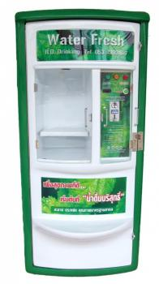

# แบบรายงานการทดลองครั้งที่ 2
## ตัวอย่าง
**สถานการณ์ที่ 1** : นายไก่อยากกินไข่เจียว เขามีอุปกรณ์เตรียมพร้อมทำไข่เจียวครบทุกอย่าง
**จงเขียนอัลกอริทึมและผังงานการทำไข่เจียว**
**ข้อมูลเข้า** : _ไข่ไก่_
**ข้อมูลออก** : _ไข่เจียว_
**อัลกอริทึม ของการทอดไข่เจียว**
1.  หยิบไข่ไก่
2.  ตอกไข่ไก่ใส่ภาชนะ
3.  ปรุงรสด้วยเครื่องปรุง
4.  ตีไข่ด้วยช้อนส้อม
5.  ตั้งกระทะบนเตา
6.  เปิดแก๊ส และติดไฟ
7.  ใส่น้ำมันพืช
8.  นำไข่ที่ปรุงรสแล้วใส่ลงในกระทะร้อน
9.  ทอดจนสุก
10. ตักขึ้นใส่จานที่เตรียมไว้
----------
## ขั้นตอนการทดลอง
**สถานการณ์ที่ 2** : นักเรียนเดินทางมาวิทยาลัยโดยมีเงิน 100 บาท
**จงเขียนอัลกอริทึมเพื่อช่วยให้นักเรียนสามารถเดินทางมาวิทยาลัยได้ เริ่มตั้งแต่ตื่นนอนจนถึงวิทยาลัย**
**ข้อมูลเข้า** : $1    เรามาวิทยาลัย   1$
**ข้อมูลออก** : $2   เรามาถึงวิทยาลัย   2$
**อัลกอริทึม ในการเดินทางมาวิทยาลัย**
$3
1.  ตื่นนอน
2.  ลุกจากเตียง
3.  ล้างหน้าแปรงฟัน
4.  อาบน้ำ
5.  แต่งตัว
6.  กินข้าว
7.  แม่ให้เงิน 100 บาท
8.  พ่อขับรถมาส่งที่รถสองแถว
9.  ขึ้นรถสองแถว
10. ลงจากรถสองถว
11. จ่ายเงินค่ารถสองแถว 6 บาท
12. ข้ามถนน
13. เดินเข้าวิทยาลัย

3$
----------
**สถานการณ์ที่ 3** : นักเรียนเกิดอยากไปซื้อของที่เซเว่นหน้าวิทยาลัย โดยหน้าวิทยาลัยจะมีทางม้าลาย และสัญญาณไฟจราจร บนถนนมีรถสัญจรไปมาเป็นระยะๆ
**จงเขียนอัลกอริทึมและผังงานเพื่อให้นักเรียนสามารถข้ามถนนไปซื้อของที่เซเว่นได้ โดยไม่ถูกรถชน**
**ข้อมูลเข้า** : $4    นักเรียนที่จะข้ามถนน   4$
**ข้อมูลออก** : $5   นักเรียนที่ข้ามถนนได้แล้ว    5$
**อัลกอริทึม ในการเดินทางไปเซเว่นหน้าวิทยาลัย**
$6
1.  เดินออกจากวิทยาลัย
2.  ยืนรอรถริมถนนตรงทางม้าลาย
3.  ดูรถทางซ้าย
4.  ดูรถทางขวา
5.  ถ้าไม่มีรถข้ามได้ ถ้ามีให้ยืนรอต่อไป
6.  ข้ามถนนได้สำเร็จ
6$
----------
**สถานการณ์ที่ 4** : นักเรียนไปซื้อข้าวที่โรงอาหาร ซึ่งจะมีการจ่ายเงินซื้อคูปอง โดยคูปองมี 3 ราคา คือ 5, 10 และ 20 บาท ถ้านักเรียนเป็นคนจ่ายคูปอง นักเรียนจะมีวิธีการอย่างไร ที่จะใช้จำนวนใบคูปองให้น้อยที่สุด
**จงเขียนอัลกอริทึมเพื่อแสดงวิธีการแลกคูปองให้ได้จำนวนใบน้อยที่สุด**
**ข้อมูลเข้า** : $7    เงิน   7$
**ข้อมูลออก** : $8   คูปอง   8$
**อัลกอริทึม การแลกคูปองให้ได้จำนวนใบน้อยที่สุด**
$9
1.  นำเงินมาแลก 25 บาท2.  แลกคูปอง 20 บาท ได้ 1 ใบ3.  เหลือ 5 บาท4.  แลกคูปอง 5 บาท ได้ 1 ใบ5.  ได้คูปอง 25 บาท 6.  ซื้อข้าว
9$
----------
## ภาระงาน
**วิเคราะห์และออกแบบการทำงานของตู้กดน้ำอัตโนมัติ พร้อมทั้งเขียนคู่มือและบอกแนวทางการบริการและบำรุงรักษา**

**วิเคราะห์และออกแบบ**
$10
1.  ทำช่องจ่ายน้ำขนาด 1.5 - 20 ลิตร
2. ทำช่องหยอดเหรียญ ตั้งแต่ 1 บาทขึ้นไป
3. ทำปุ่มสีเขียวไว้สำหรับจ่ายน้ำ
4. ทำปุ่มสีเขียวไว้สำหรับหยุดน้ำ

10$
**คู่มือสำหรับผู้ใช้**
$11
1.  นำขวดนำไปใส่ที่ช่องรับน้ำ
2.  หยอดเหรียญลงไปในช่องหยอดเหรียญ
3.  กดปุ่มสีเขียว เพื่อรับน้ำ
4.  กดปุ่มสีแดง ให้หยุดจ่ายน้ำ
5.  เมื่อหมดจำนวนเงินน้ำก็จะหยุดจ่ายทันที
11$
**แนวทางการบำรุงรักษา**
$12
1. เปลี่ยนกรองน้ำทุกๆ 3 สัปดาห์ เพื่อป้องกันสิ่งสกปรก
12$
